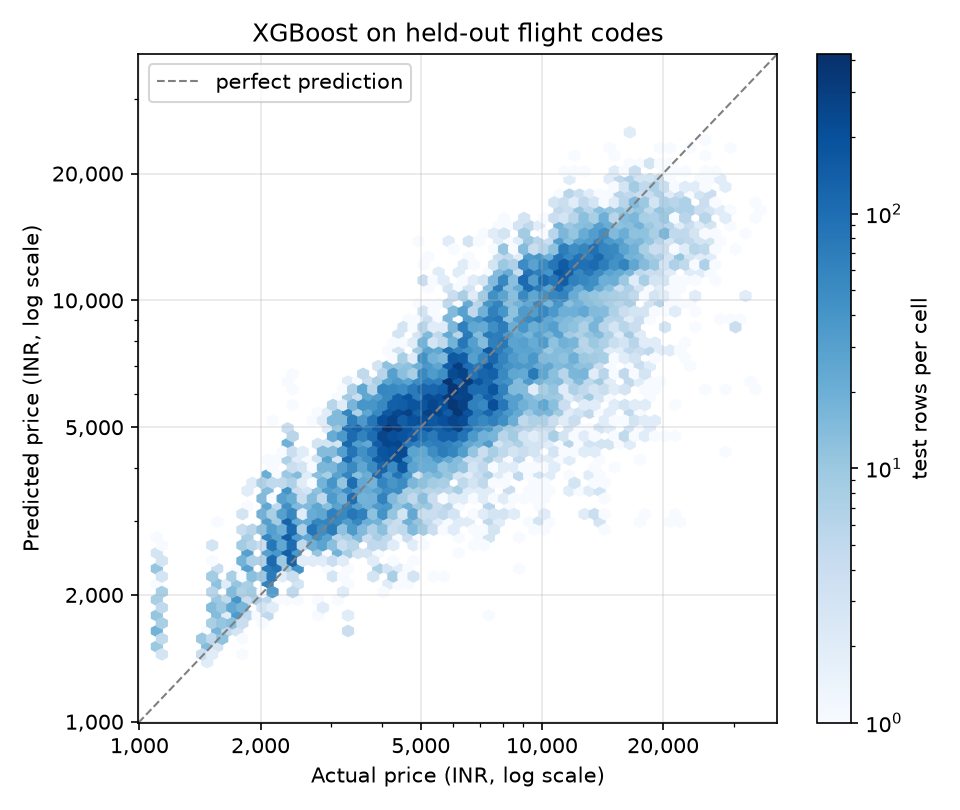

# Flight Price Prediction

How well can economy fares between India's six largest cities be predicted for flights the model has never seen?

## Results

Test set: 41,253 economy fares on 312 flight codes that are not in the training data. Errors are in rupees.

| Model | MAE (INR) | RMSE (INR) | MAPE (%) | R2 (log price) |
|---|---:|---:|---:|---:|
| Baseline: training median | 2,537 | 3,759 | 42.7 | 0.000 |
| OLS | 1,697 | 2,539 | 26.8 | 0.565 |
| Ridge | 1,697 | 2,539 | 26.8 | 0.565 |
| PCR | 1,845 | 2,703 | 29.4 | 0.480 |
| RandomForest | 1,256 | 2,068 | 18.7 | 0.739 |
| XGBoost | 1,202 | 1,952 | 17.8 | 0.775 |



Run on 2026-09-26. The extra-seed MAE range and the random-split comparison are also in [results/metrics.md](results/metrics.md); per-airline errors are plotted in [results/mae_by_airline.png](results/mae_by_airline.png).

## Data

- Source: [Flight Price Prediction](https://www.kaggle.com/datasets/shubhambathwal/flight-price-prediction) on Kaggle (Shubham Bathwal). Fares scraped from EaseMyTrip for flights between Delhi, Mumbai, Bangalore, Kolkata, Hyderabad and Chennai, 11 Feb - 31 Mar 2022.
- License: CC0: Public Domain.
- Size: `Clean_Dataset.csv`, 24.7 MB, 300,153 rows (economy and business).
- To get it: sign in to Kaggle, open the dataset page, click Download, unzip, and copy `Clean_Dataset.csv` out of the archive. The archive also has `economy.csv` and `business.csv`, which are not used.
- Put it at `data/Clean_Dataset.csv`. Everything in `data/` except its README is gitignored. The columns are described in [data/README.md](data/README.md).

## Approach

- Rows: economy class only (206,666 of 300,153).
- Features: airline, source and destination city, departure and arrival time-of-day bucket, stops (all one-hot), duration in hours, and days_left (days between the fare quote and departure). The flight code is not a feature.
- Target: log(price). Predictions are exp(predicted log price), which estimates the median fare for a set of features rather than the mean.
- Split: GroupShuffleSplit on flight code, 20% of codes held out, seed 42. That gives 165,413 training rows on 1,248 codes and 41,253 test rows on 312 codes, with no code in both. A code shows up on many rows (different days before departure, often different routes), so a random row split would put near-copies of test rows into training.
- Extra seeds: after the seed-42 fit I refit only RandomForest and XGBoost on GroupShuffleSplit seeds 0, 1, 2, 3 and 7, same hyperparameters and features, and write each seed's MAE plus the min, max and mean. I also refit those two models on a random 80/20 row split so the inflation from sharing flight codes is visible.
- Models: training-median baseline; OLS in statsmodels with the first level of each categorical dropped so the coefficients are identifiable; Ridge (alpha=1.0); PCR (PCA keeping 95% of variance, 23 components, then linear regression); RandomForest (200 trees, min_samples_leaf=2); XGBoost (400 rounds, max_depth 6, learning_rate 0.05). Hyperparameters are fixed, not tuned. Encoding and scaling sit inside scikit-learn pipelines fitted on the training rows only.

## What I found

On the seed-42 split I get an XGBoost MAE of 1,202 INR against 1,256 for RandomForest and 2,537 for the baseline. Across seeds 0, 1, 2, 3 and 7 that order is not stable: XGBoost MAE runs from 1,101 to 1,269 (mean 1,212) and RandomForest from 1,087 to 1,312 (mean 1,239), and seed 2 reverses it.

A random row split, where 100.0% of test rows share a flight code with training, changes RandomForest MAE from 1,256 to 581 and XGBoost from 1,202 to 998. I would have picked RandomForest on that split and overstated how well it handles new flights.

I expected Ridge to improve a little on OLS; it matched OLS to the rupee (both 1,697). PCR was worse than OLS (1,845 vs 1,697).

My largest per-airline error is on SpiceJet (XGBoost MAE 1,736 INR, 1,484 test rows); GO_FIRST and Indigo are the lowest (1,050 and 1,062).

## Limitations

- One booking site over 11 Feb - 31 Mar 2022. The model has not been checked against fares from any other period or site.
- `Clean_Dataset.csv` has no calendar date, only days_left, so day-of-week, holiday and seasonal effects can't be modelled.
- The split holds out flight codes, not routes or airlines. Every route and airline in the test set also appears in training, so this does not measure accuracy on a new route or carrier.
- The published table is one GroupShuffleSplit (seed 42). Extra seeds 0, 1, 2, 3 and 7 give a MAE range for the tree models, not a confidence interval, and I have not tuned hyperparameters on a grouped validation split inside the training flights.

## How to run

Python 3.13.

Windows (PowerShell):

```powershell
py -3.13 -m venv .venv
.venv\Scripts\python.exe -m pip install -r requirements.txt
.venv\Scripts\python.exe src/flight_price_models.py --data data/Clean_Dataset.csv --results-dir results
```

macOS / Linux:

```bash
python3.13 -m venv .venv
source .venv/bin/activate
pip install -r requirements.txt
python src/flight_price_models.py --data data/Clean_Dataset.csv --results-dir results
```

This prints row counts after each filter and the metrics tables, and writes `results/metrics.md`, `results/pred_vs_actual.png` and `results/mae_by_airline.png`. Most of the run time goes into the RandomForest fits (main split, random split and the extra seeds). The OLS coefficient table, with standard errors clustered by flight code because rows of one flight are not independent, goes to `outputs/ols_summary.txt` (gitignored). `--n-jobs N` sets the thread count for RandomForest and XGBoost; by default XGBoost uses 4 threads, because its scores shift slightly with the thread count.

Tests (a smoke test on a small synthetic dataset, no download needed) and lint:

Windows (PowerShell):

```powershell
.venv\Scripts\python.exe -m pip install -r requirements-dev.txt
.venv\Scripts\python.exe -m ruff check .
.venv\Scripts\python.exe -m pytest -q
```

macOS / Linux:

```bash
pip install -r requirements-dev.txt
ruff check .
pytest -q
```

## Context

Built for the Regression & Time Series Modelling course (PGDBA, IIT Kharagpur) in 2023; rewritten in 2026.
